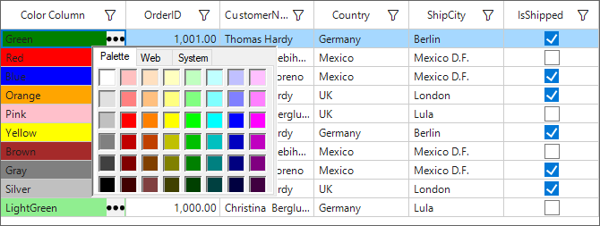

# How to add the ColorPicker column in WinForms DataGrid (SfDataGrid)?

## About the sample
This example illustrates how to add the ColorPicker column in [WinForms DataGrid](https://www.syncfusion.com/winforms-ui-controls/datagrid) (SfDataGrid)?

[WinForms DataGrid](https://www.syncfusion.com/winforms-ui-controls/datagrid) (SfDataGrid) does not have a build in **ColorPickerColumn**, but we can create the **ColorPickerColumn** by customizing the [GridColumn](https://help.syncfusion.com/cr/windowsforms/Syncfusion.WinForms.DataGrid.GridColumn.html) and [GridCellRendererBase](https://help.syncfusion.com/cr/windowsforms/Syncfusion.Windows.Forms.Grid.GridCellRendererBase.html) in [WinForms DataGrid](https://www.syncfusion.com/winforms-ui-controls/datagrid) (SfDataGrid). You can add both button and text in a column by customizing [GridTextBoxCellRenderer](https://help.syncfusion.com/cr/windowsforms/Syncfusion.WinForms.DataGrid.Renderers.GridTextBoxCellRenderer.html). In the custom renderer, the [OnRender](https://help.syncfusion.com/cr/windowsforms/Syncfusion.WinForms.DataGrid.Renderers.GridTextBoxCellRenderer.html#Syncfusion_WinForms_DataGrid_Renderers_GridTextBoxCellRenderer_OnRender_System_Drawing_Graphics_System_Drawing_Rectangle_System_String_Syncfusion_WinForms_DataGrid_Styles_CellStyleInfo_Syncfusion_WinForms_DataGrid_DataColumnBase_Syncfusion_WinForms_GridCommon_ScrollAxis_RowColumnIndex_) method can be overridden to draw buttons in the cells when click on the button shows the **ColorPicker**.

```C#

//To add custom renderer into SfDataGrid.
this.sfDataGrid.CellRenderers.Add("ColorPicker", new GridColorPickeCellRenderer(this.sfDataGrid));

//To add GridColorPickeColumn in grid
this.sfDataGrid.Columns.Add(new GridColorPickeColumn() { HeaderText = "Color Column", MappingName = "CustomerID", Width = 140 });

```

```C#

//Create the custom column
public class GridColorPickeColumn : GridTextColumn
{
        private CellButton cellButton;

        public CellButton CellButton
        {
            get { return cellButton; }
            set { cellButton = value; }
        }
        
        public GridColorPickeColumn()
        {
            SetCellType("ColorPicker");
        }
}

```

```C#
//Custom Column Cell renderer
public class GridColorPickeCellRenderer : GridTextBoxCellRenderer
{
        public GridColorPickeCellRenderer(SfDataGrid dataGrid)
        {
            IsEditable = true;
            DataGrid = dataGrid;
            this.DataGrid.CellClick += DataGrid_CellClick;
            DropDownContainer = new PopupControlContainer();            
        }

        private void DataGrid_CellClick(object sender, CellClickEventArgs e)
        {
            if (dropdownContainer.Visible)
            {
                if (this.colorUI != null)
                {                   
                    colorUI.Visible = false;
                    dropdownContainer.HidePopup(PopupCloseType.Done);
                }
            }
        }
      
        protected SfDataGrid DataGrid { get; set; }

        protected override void OnRender(Graphics paint, Rectangle cellRect, string cellValue, CellStyleInfo style, DataColumnBase column, RowColumnIndex rowColumnIndex)
        {
            this.SelectedColor = ColorConvert.ColorFromString(cellValue);
            style.BackColor = SelectedColor;
            base.OnRender(paint, cellRect, cellValue, style, column, rowColumnIndex);            
            //To set the rectangle for button in the cell.
            var rect = new Rectangle(cellRect.Location.X + cellRect.Width - 22, cellRect.Location.Y, 20, cellRect.Height);

            (column.GridColumn as GridColorPickeColumn).CellButton = new CellButton();
            (column.GridColumn as GridColorPickeColumn).CellButton.Image = Image.FromFile(@"..\..\Images\icons.png");
            (column.GridColumn as GridColorPickeColumn).CellButton.TextImageRelation = TextImageRelation.ImageBeforeText;

            PropertyInfo highlightedItemProperty = (column.GridColumn as GridColorPickeColumn).CellButton.GetType().GetProperties(BindingFlags.NonPublic | BindingFlags.Instance).Single(pi => pi.Name == "Bounds");
            highlightedItemProperty.SetValue((column.GridColumn as GridColorPickeColumn).CellButton, rect);

            //To draw the button in cell
            DrawButton(paint, cellRect, rect, "...", new ButtonCellStyleInfo(), column, rowColumnIndex);
        }

        protected override void OnInitializeEditElement(DataColumnBase column, RowColumnIndex rowColumnIndex, TextBox uiElement)
        {          
            base.OnInitializeEditElement(column, rowColumnIndex, uiElement);            
            uiElement.BackColor = ColorConvert.ColorFromString(uiElement.Text); ;
        }        

        public virtual void DrawButton(Graphics paint, Rectangle cellRect, Rectangle buttonRect, string cellValue, ButtonCellStyleInfo style, DataColumnBase column, Syncfusion.WinForms.GridCommon.ScrollAxis.RowColumnIndex rowColumnIndex, int buttonIndex = 0)
        {
            // No need to draw the button when its not visible on the cell bounds.
            if (cellRect.Width < 5)
                return;         

            var clipBound = paint.ClipBounds;
            var cellButton = (column.GridColumn as GridColorPickeColumn).CellButton;

            bool drawHovered = false;

            DrawBackground(paint, buttonRect, style, drawHovered,cellButton);

            if (cellRect.Contains(buttonRect))
                paint.SetClip(buttonRect);
            else if (cellRect.IntersectsWith(buttonRect))
            {
                Rectangle intersectRect = Rectangle.Intersect(cellRect, buttonRect);
                paint.SetClip(intersectRect);
            }

            if (cellButton.Image != null)
            {
                var imageSize = cellButton.Image.Size.IsEmpty ? cellButton.Image.Size : Size.Empty;
                Rectangle imageRectangle = buttonRect;
                DrawImage(paint, imageRectangle, cellButton.Image);
            }
               
            paint.SetClip(cellRect);
            DrawBorder(paint, buttonRect, style, drawHovered);
            paint.SetClip(clipBound);
        }

        private void DrawBorder(Graphics paint, Rectangle buttonRect, ButtonCellStyleInfo style, bool drawHovered)
        {
            if (style.Enabled)
            {
                if (style.BorderColor != null)
                    paint.DrawRectangle(style.BorderColor, Rectangle.Round(buttonRect));
            }
            else
            {
                if (style.DisabledBorderColor != null)
                    paint.DrawRectangle(style.DisabledBorderColor, Rectangle.Round(buttonRect));
            }
        }
       
        private void DrawBackground(Graphics paint, Rectangle buttonRect, ButtonCellStyleInfo style, bool drawHovered,CellButton cellButton)
        {
            Color color = style.BackColor;
            if (style.Enabled)
            {

                color = style.BackColor;
            }
            else
            {
                color = style.DisabledBackColor;
            }

            paint.FillRectangle(new SolidBrush(color), buttonRect);
        }

        protected internal virtual void DrawImage(Graphics graphics, Rectangle bounds, Image image)
        {
            graphics.DrawImage(image, Rectangle.Ceiling(bounds), 0, 0, image.Width, image.Height, GraphicsUnit.Pixel);
        }        

        protected override void OnMouseDown(DataColumnBase dataColumn, RowColumnIndex rowColumnIndex, MouseEventArgs e)
        {
            base.OnMouseDown(dataColumn, rowColumnIndex, e);
            var cellButton = (dataColumn.GridColumn as GridColorPickeColumn).CellButton;
            PropertyInfo highlightedItemProperty = (dataColumn.GridColumn as GridColorPickeColumn).CellButton.GetType().GetProperty("Bounds",BindingFlags.NonPublic|BindingFlags.Instance);//.GetProperties(BindingFlags.NonPublic | BindingFlags.Instance).Single(pi => pi.Name == "Bounds");
            Rectangle rect =(Rectangle)highlightedItemProperty.GetValue((dataColumn.GridColumn as GridColorPickeColumn).CellButton);
            var cellLocation = new Point(450, (300 + (this.DataGrid.RowHeight * (this.DataGrid.TableControl.ResolveToRecordIndex(rowColumnIndex.RowIndex)))));
            if (e.Location.X > rect.X && e.Location.X < (rect.X + rect.Width))
            {
                this.dropdownContainer.ParentControl = DataGrid.TableControl;
                DropDownContainer.Location = cellLocation;
                InitializeDropdownContainer();
                colorUI.Location = cellLocation;               
                DropDownContainer.Size = new Size(208, 230);
                DropDownContainer.FocusParent();
                DropDownContainer.ShowPopup(cellLocation);
                var cellRect = DataGrid.TableControl.GetCellRectangle(rowColumnIndex.RowIndex, rowColumnIndex.ColumnIndex, true);
                DataGrid.Invalidate(cellRect); 
            }   
        }        

        private void UpdateSummaryValues(int rowIndex, int columnIndex)
        {           
            columnIndex = this.TableControl.ResolveToGridVisibleColumnIndex(columnIndex);
            if (columnIndex < 0)
                return;
            var mappingName = DataGrid.Columns[columnIndex].MappingName;
            var recordIndex = this.TableControl.ResolveToRecordIndex(rowIndex);
            if (recordIndex < 0)
                return;
            if (DataGrid.View.TopLevelGroup != null)
            {
                var record = DataGrid.View.TopLevelGroup.DisplayElements[recordIndex];
                if (!record.IsRecords)
                    return;
                var data = (record as RecordEntry).Data;

                //below case using for DataTable Collection when dataGrid Grouped to set value
                //(data as DataRowView).Row[mappingName] = ColorConvert.ColorToString(colorUI.SelectedColor, true);

                //below case using for ObservableCollection when dataGrid Grouped to set value
                data.GetType().GetProperty(mappingName).SetValue(data, ColorConvert.ColorToString(colorUI.SelectedColor, true));
            }
            else
            {
                var record1 = DataGrid.View.Records.GetItemAt(recordIndex);

                //below case using for DataTable Collection to update based on selected value
                //(record1 as DataRowView).Row[mappingName] = ColorConvert.ColorToString(SelectedColor, true);

                //below case using for ObservableCollection to set value
                record1.GetType().GetProperty(mappingName).SetValue(record1, ColorConvert.ColorToString(SelectedColor, true));
            }
        }        

        ColorUIControl colorUI;

        private PopupControlContainer dropdownContainer = null;        

        public PopupControlContainer DropDownContainer
        { 
            get
            {               
                return dropdownContainer;
            }

            set
            {
                dropdownContainer = value;
            }
        }

        void InitializeDropdownContainer()
        {            
            if (this.dropdownContainer != null)
            {
                colorUI = new ColorUIControl();
                colorUI.Name = "ColorUIControl";
                colorUI.ColorSelected += new EventHandler(this.OnCUIColorSelected);
                colorUI.Dock = DockStyle.Fill;
                colorUI.Visible = true;               
                this.dropdownContainer.Controls.Add(colorUI);
            }
        }

        Color color;

        Color SelectedColor
        {

            get
            {
                return color;
            }

            set
            {
                color = value;
            }
        }

        void OnCUIColorSelected(object sender, EventArgs e)
        {
            if (!string.IsNullOrEmpty(this.colorUI.SelectedColor.Name))
                this.SelectedColor = this.colorUI.SelectedColor;
            colorUI.Visible = false;
            dropdownContainer.HidePopup(PopupCloseType.Done);
            UpdateSummaryValues(this.CurrentCellIndex.RowIndex, this.CurrentCellIndex.ColumnIndex);
        }
}  

```


The following screenshot shows the ColorPicker column in [WinForms DataGrid](https://www.syncfusion.com/winforms-ui-controls/datagrid) (SfDataGrid),


Take a moment to peruse the [WinForms DataGrid – Custom Column Support](https://help.syncfusion.com/windowsforms/datagrid/columntypes#custom-column-support) documentation, where you can find about custom column support with code examples.

## Requirements to run the demo
Visual Studio 2015 and above versions
